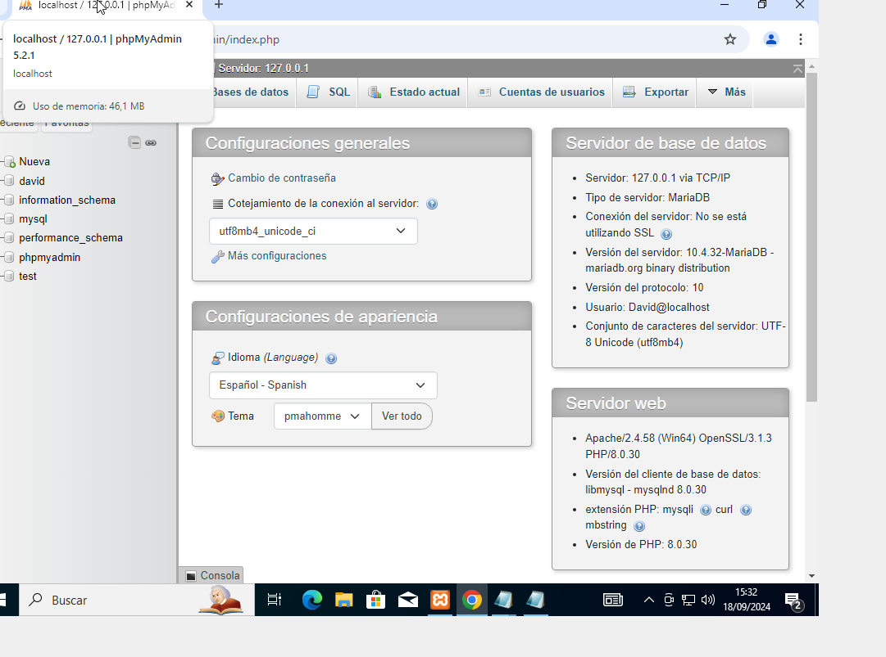
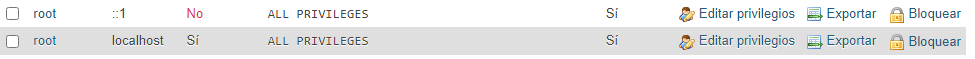
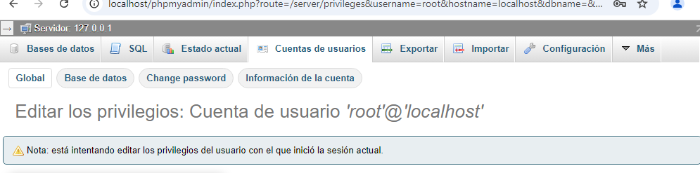
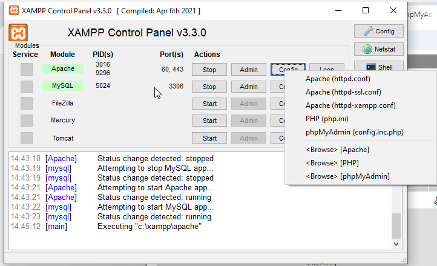
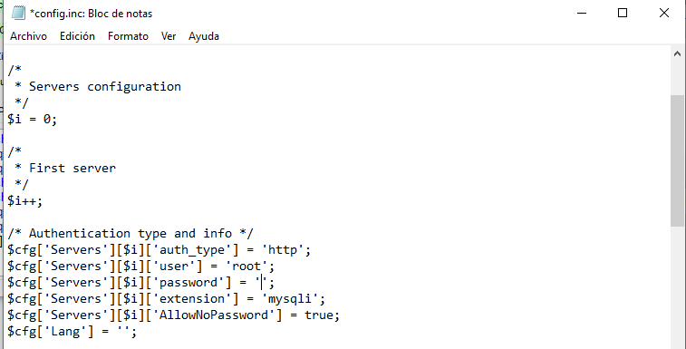
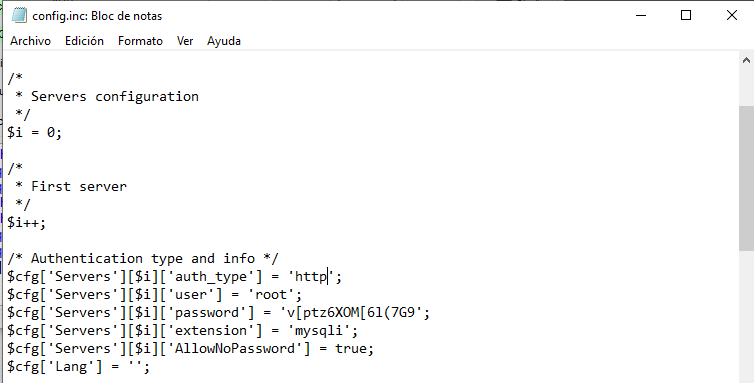
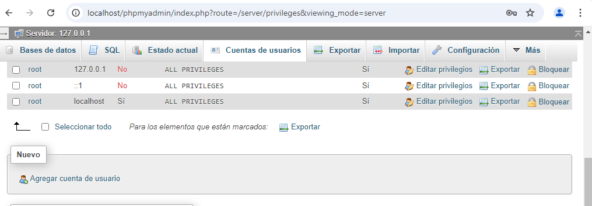
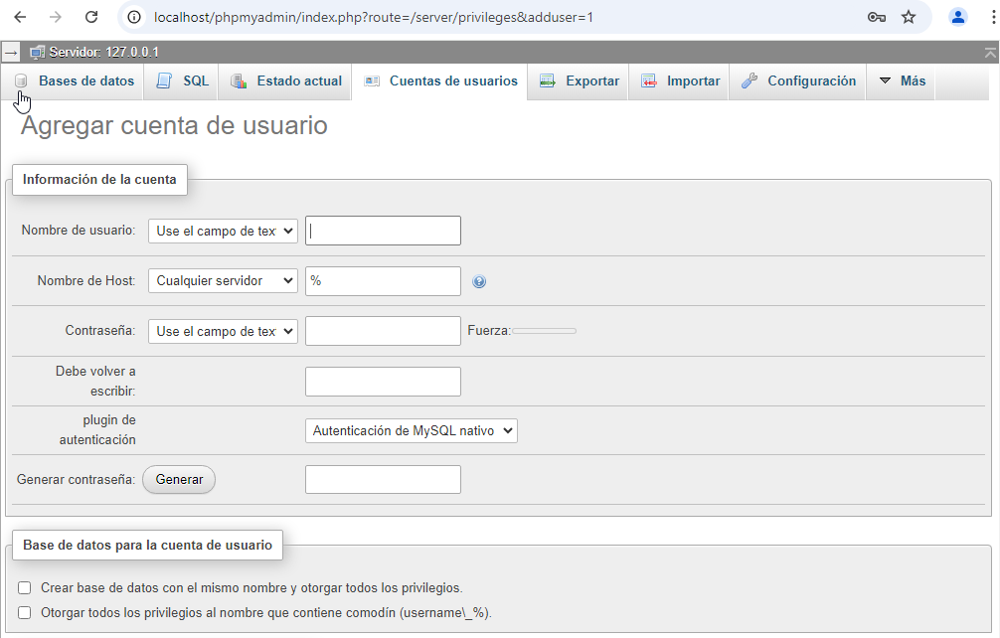
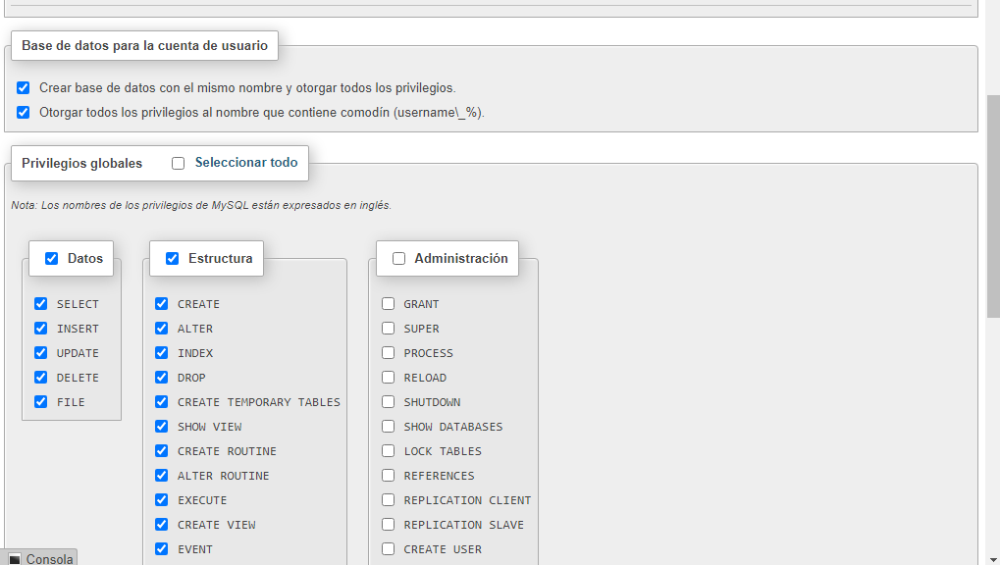
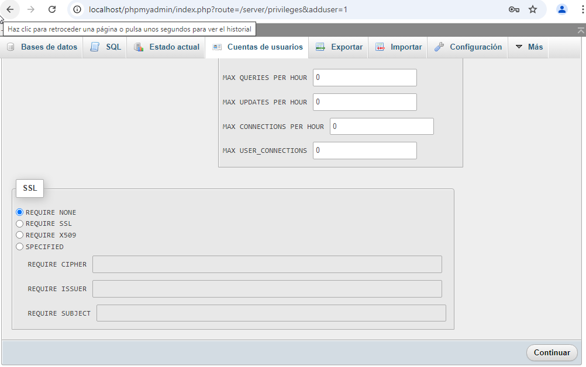

Informe de phpMyAdmin

Iniciaremos los servicios de aparche y MyAdmin

Tendremos que estar en nuestro navegador con esta pagina

Poner una contraseña a root:

De manera predeterminada el usuario root está sin contraseña, esto puede ocasionar fallo de seguridad, por ello debemos ponerle una contraseña

Seleccionamos la pestaña “Cuentas de usuarios”, Nos saldrá el usuario root, al seleccionar “Editar privilegios”

 

En la parte de arriba tenemos la opción de cambiar contraseña. Ponemos una nueva contraseña y hay que ponerla dos veces. Le damos a continuar.

Al hacer eso nos saldrá un error en el navegador, ahora tenemos que modificar el php para poner la nueva contraseña.

Vamos al panel de control, apretamos el botón de Config y seleccionamos phpMyAdmin(config.inc.php)

En la fila donde está la palabra ‘password’ tendrá dos comillas vacías [‘’], aquí es donde tenemos que poner la contraseña que hemos creado

Con este cambio realizado, al actualizar la página ya no nos saldrá un error

Agregar un nuevo usuario:

En las cuentas de usuario, vamos bajando hasta que veamos la opción de “Agregar cuenta de usuario”

Ponemos el nombre del usuario
Quitamos el símbolo % y ponemos localhost
Le asignamos una contraseña al usuario

Le damos los permisos correspondientes al usuario

Para finalizar le damos a continuar

Pedir un Usuario:

De manera predeterminada no te pide Usuario el phpMyAdmin, nos vamos al panel xampp, Apache , Config y seleccionamos la 5 opción

En la línea donde está entre corchete [‘auth_type’] nos sale  entre comillas vació pues ponemos ‘http’.

Después si volvemos al navegador, ponemos localhost/php/admin nos pedirá el usuario y la contraseña

