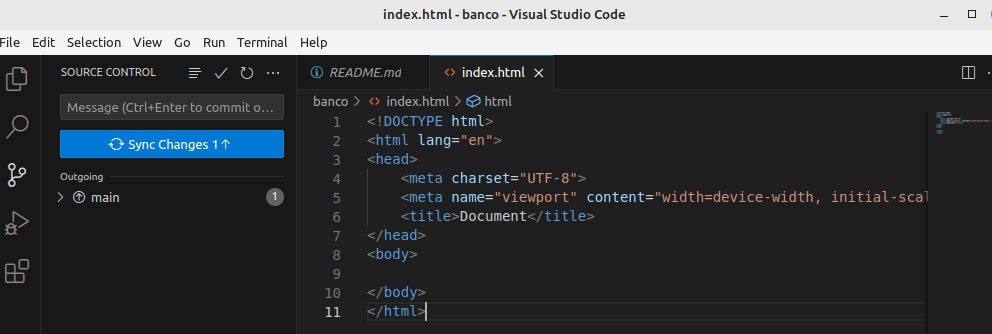
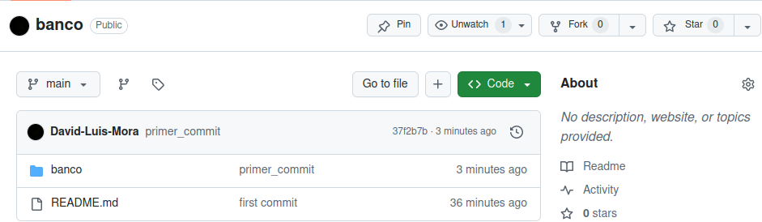

Creamos un nuevo repositorio

Le ponemos el nombre del repositorio

Creamos un repositorio por comando

 

Ya tenemos el repositorio creado

Creamos la carpeta banco en otra ubicación en nuestro equipo

Pegamos la carpeta del banco en nuestro repositorio local

Aquí enlazamos nuestro github con nuestro visual estudio

En nuestra carpeta de banco añadimos un index.html 

Hacemos nuestro primer commit de nuestro repositorio local

Subimos lo cambio a nuestro repositorio remoto

Ya se han subido los cambio a nuestro repositorio

Borramos todo lo que tenemos en la carpeta

Clonamos desde el visual studio todo de nuestro repositorio y ya tendremos todo del repositorio en nuestro equipo

Modificamos el html que hemos bajado

Guardamos los cambios en el local

Lo subimos a nuestro repositorio remoto

Aquí tenemos los cambio subido

