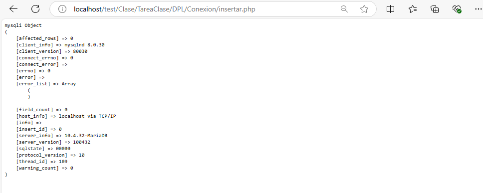

Levantamos en xampp los servicios de apache y myql

Vamos phpMyAdmin y le damos a nueva

Ponemos el nombre y le damos a crear

Ponemos nombre a nuestra tabla

LLenamos los datos en sus respectiva colummna

<!-- 
 -->

Al poner un campo en primary key nos saldra una pantalla asi, le damos a continuar y seguimos rellenado los datos en sus apartado correspondiente

Al poner toda la informacion como se muestra en las imagenes ya esta creado nuestra tabla

Creamos un archivo llamado conexion.php

<!--  -->

Creamos el archivo insertar.php de esta forma. Con este archivo podremos meter un registro en la tabla de users

Nos saldria asi en nuestro navegador

Aqui tenemos la insercion de dato en la base de dato

