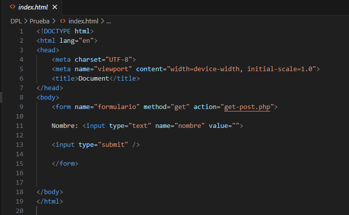
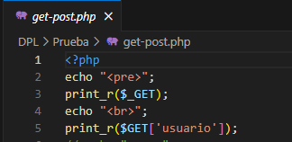
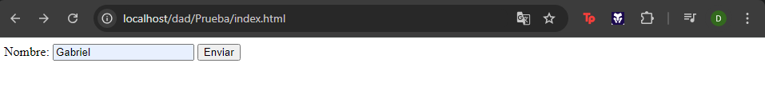
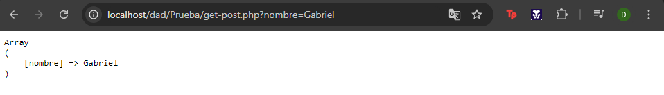
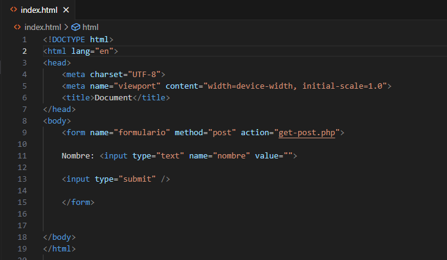
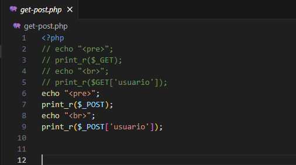
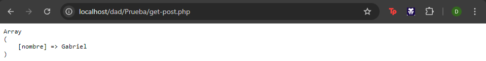

Creamos un archivo html

Creamos el archivo get-post.php

Al tener levantado el apache de xampp cuando abrimos nuestro  formulario y al poner algo en el input y darle al boton de enviar pues no saldra en esta pagina la variable mostra en pantalla

Estamos usando el metodo get, asiendolo de esta forma hacemos pasar la informacion a otro lugar, esta manera no es la mas segura ya que dicha informacion se muestra en el URL del navegador

Ahora cambiaremos el index y el php para poder usar el metodo post

Asi nos saldria

