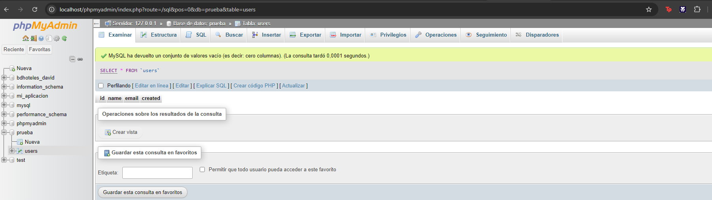

Debemos tener encendido el apache y el phpAdmin

Creamos el archivo insertar.php de esta forma

Al ir a nuestro navegador se ejecutara nuestro php, se nos insertar el registro en nuestra base datos

Vamos a nuestro phpAdmin y al mirar en la tabla de usuario vemos el registro en la base de datos

A continuacion creamos el archivo leer.php como se muestra en la imagen

Si vamos a nuestro navegador se nos mostra los dato de nuestra consulta
Se ve en el array el nombre de la persona, correo y fecha de cuando se creo

El ultimo archivo que hay que crear es de update.php, como se muestra en la imagen. Lo que hace el codigo es buscar en la base de dato en la tabla users cambiarle el nombre a 'alex22' y el email a 'alex22@dominio.com' el registro con el id = 0

En la imagen se muestra que dato tiene el registro en la tabla de users

Si vamos en el navegador, se ejecutara el archivo haciendonos ver como se ve en la imagen

Al volver a nuestra base de dato se ve que el registro se ha modificado a los cambios correspondiente

En el mismo archivo para poder hacer la eliminacion hay que hacer pequeños cambios como se ve en la imagen. Tendremos que tener el codigo como se ve en la imagen

Al ir al navegador se nos ejecutar el archivo y se vera como se ve en la imagen

Si volvemos a consultar la tabla de users en la base de dato el registro ya no esta. Se abra ejecutado corectamente

