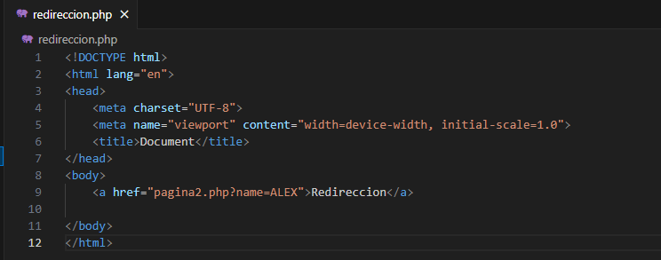
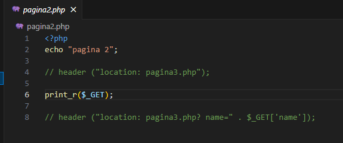
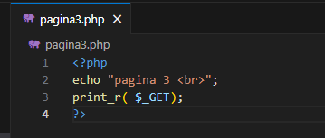
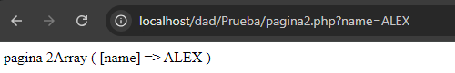
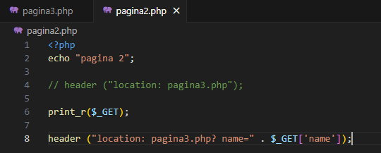
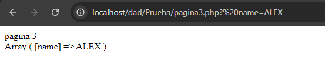

Creamos un html en el archivo redireccion.php

Creamos el archivo pagina2.php

Creamos el archivo pagina3.php

Nos saldria asi en la pagina 2

Cambiamos en la pagina 2 para poder mandarlo a la 3 pagina y que se nos muestre en ella

Deberia mostrarse de esta forma

