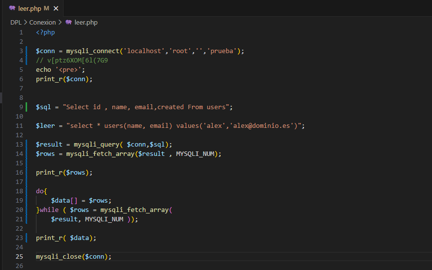
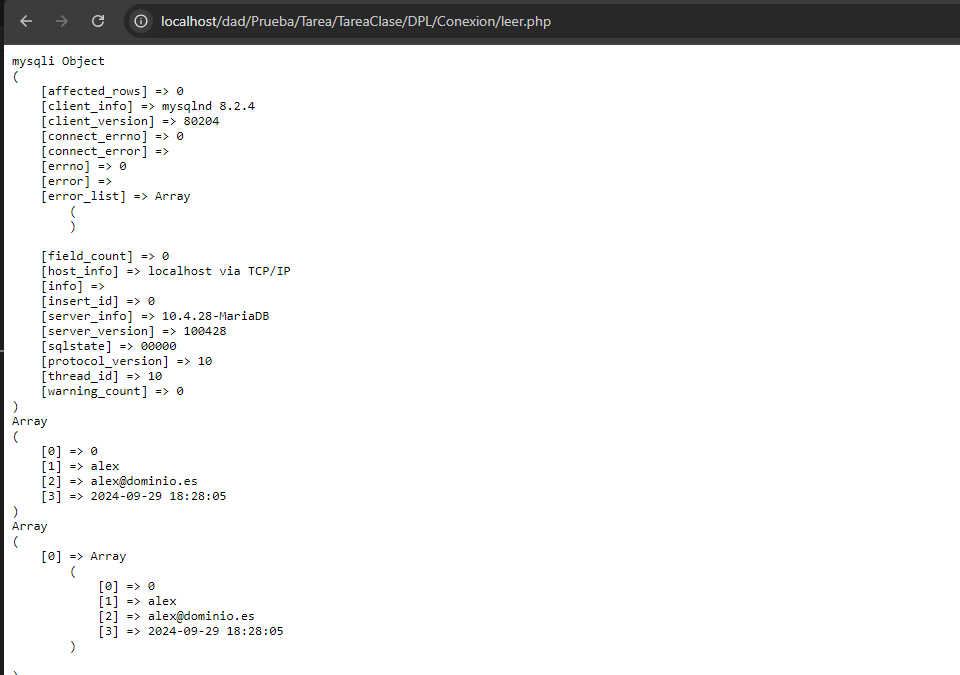
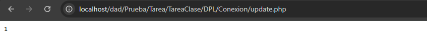
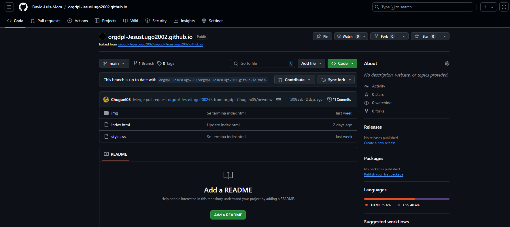
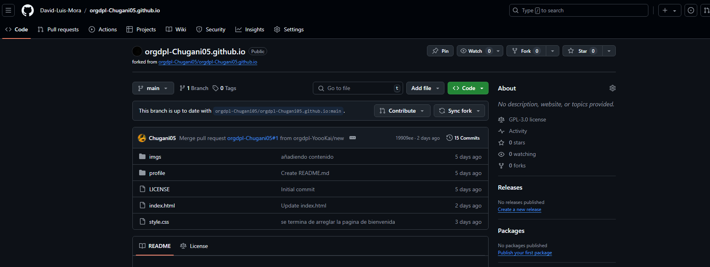
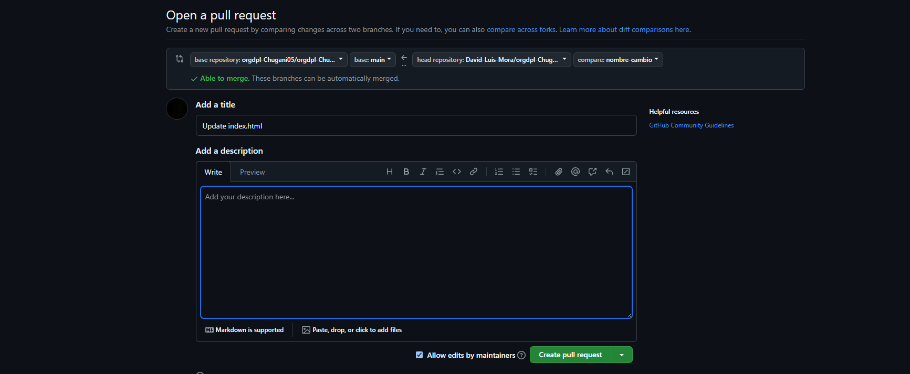
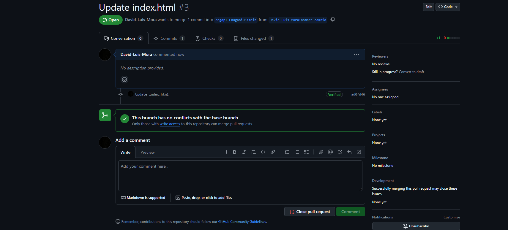
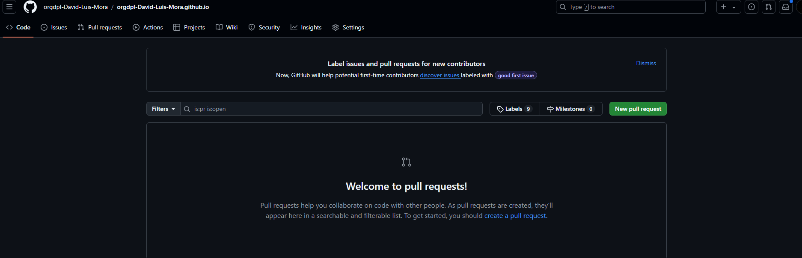

Primero si no existe el archivo README lo crea y si ya existe escribe el mensaje.
A continuacion inicializa un repositorio Git en el directorio actual, despues añadimos dicho
archivo para el proximo guardado. Hace el primer guardado con el mensaje primer commit. Mas tarde renombra la rama actual en main y en el sigueinte comando añade un repositorio remoto con el alias origin, que apunta a la URL de GitHub proporcionada. Al finalizar haciendo el push subimos los cambios del repositorio local al remositorio remoto

echo "# DPL_A_David" >> README.md
git init
git add README.md
git commit -m "first commit"
git branch -M main
git remote add origin https://github.com/David-Luis-Mora/DPL_A_David.git
git push -u origin main

Para poder hacer que git ignore estos dos archivos se crea el archivo .gitignore, donde se pone los nombre de los archivos como se muestra en la captura de pantalla y al querer añadir los nuevos cambios para el siguiente guardado no le aparece estos archivos.

Para crear el tag es con el comando git tag v0.1

Verificacion de dos pasos

| Nombre | GitHub                                         |
| ------ | -------------------------------------------    |
| Samuel | https://github.com/Shulkioras/DPL_A_SamuelS    |
| MArio  | https://github.com/SuperWarioGalaxy/DPL_A_MARIO|

Tarea 1.2- Trabajando con Git y MarkDown II

CREAR UNA RAMA  v0.2(1 PUNTO)
    Crear una rama v0.2.
    Posiciona tu carpeta de trabaja en esta rama.

    Te crea la nueva rama
    Te posiciona en la rama v0.2

    git branch v0.2
    git checkout v0.2

    

AÑADIR  EL FICHERO 2.txt  (1 PUNTO)
    Añadir un fichero 2.txt en la rama v0.2

    Miramos en que rama estamos
    Creamos el archivo 2.txt

    git branch
    echo. > 2.txt
    
    
    
    

CREAR UNA RAMA REMOTA v0.2 (1 PUNTO)
    Subir los cambios al repositorio remoto.

    Miramos que estamos en la rama v0.2
    Vemos los archivos que tenemos que añadir
    Añadimos el archivo 2.txt
    Guardamos los cambios en la rama local
    Se sube los cambios a nuestro repositorio remoto en la rama v0.2

    git branch
    git status
    git add 2.txt
    git commit -m "Subiendo los cambios"
    git push origin v0.2

    
    
    

MERGE DIRECTO (1 PUNTO)
    Posicionarse en la rama master.
    Hacer un merge de la rama v0.2 en la rama master.

    Nos movemos a la rama main
    Comprobamos que estamos en esta rama
    Unimos la rama v0.2 con la main. Puede ocurrir que haya conflicto, tendriamos que resolverlo

    git checkout main
    git branch
    git merge v0.2

    

MERGE CON CONFLICTO (1 PUNTO)
    En la rama master poner Hola  en el fichero 1.txt y hacer commit.
    Posicionarse en la rama v0.2 y poner Adios en el fichero 1.txt y hacer commit.
    Posicionarse de nuevo en la rama master y hacer un merge con la rama v0.2

    git checkout main
    echo "Hola" > 1.txt
    git add 1.txt
    git commit -m "Pongo Hola en el 1.txt"
    git checkout v0.2
    echo "Adios" > 1.txt
    git add 1.txt
    git commit -m "Añadir 'Adios' en 1.txt en la rama v0.2"
    git checkout main
    git merge v0.2

    
    
    

    
    

LISTADO DE RAMAS (1 PUNTO)
    Listar las ramas con merge y las ramas sin merge.

    git branch --merged
    git branch --no-merged

    

ARREGLAR  CONFLICTO (1 PUNTO)
    Arreglar el conflicto anterior y hacer un commit. Explicar como lo has arreglado incluyendo capturas de pantalla.

    
BORRAR RAMA (1 PUNTO)
    Crear un tag v0.2
    Borrar la rama v0.2

    git tag v0.2
    git tag
    git branch -D v0.2
    git tag
    git branch

    
    

LISTADO DE CAMBIOS (1 PUNTO)
    Listar los distintos commits con sus ramas y sus tags.

    git log --oneline --decorate --tags

    

CREAR UNA ORGANIZACIÓN (1 PUNTO)
    Crea una organización llamada orgdpl-tunombredeusuariodegithub ( ejemplo orgdpl-radav453 )

CREAR EQUIPOS 
    Crear dos equipos en la organización orgdpl-tunombredeusuariodegithub, uno llamado administradores con más permisos y otro colaboradores con menos permisos.
    Meter a github.com/radav453 y a 2 de vuestros compañeros de clase en el equipo de administradores.
    Meter a github.com/radav453 y a 2 de vuestros compañeros de clase en el equipo de colaboradores.

CREAR UN index.html
    Crear un index.html que se pueda ver como página web en la organización.

CREAR PULL REQUESTS
    Hacer 2 forks de 2 repositorios orgdpl-tunombredeusuariodegithub.github.io de 2 organizaciones de las que sean ni administradores ni colaboradores.
    Crear una rama en cada fork.
    En cada rama modificar el fichero index.html añadiendo vuestro nombre.
    Con cada rama hacer un pull request.

GESTIONAR PULL REQUESTS
    Aceptar los pull request que lleguen a los repositorios de tu organización.

