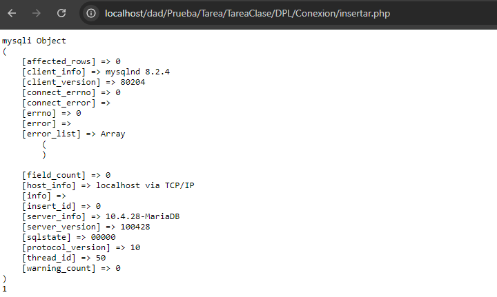
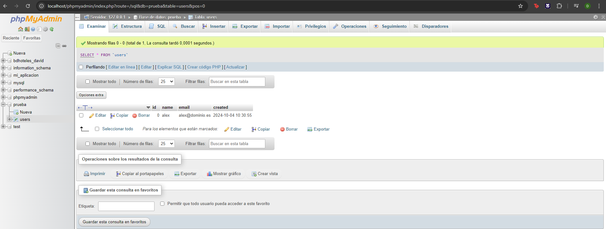

Primero si no existe el archivo README lo crea y si ya existe escribe el mensaje.
A continuacion inicializa un repositorio Git en el directorio actual, despues añadimos dicho
archivo para el proximo guardado. Hace el primer guardado con el mensaje primer commit. Mas tarde renombra la rama actual en main y en el sigueinte comando añade un repositorio remoto con el alias origin, que apunta a la URL de GitHub proporcionada. Al finalizar haciendo el push subimos los cambios del repositorio local al remositorio remoto

echo "# DPL_A_David" >> README.md
git init
git add README.md
git commit -m "first commit"
git branch -M main
git remote add origin https://github.com/David-Luis-Mora/DPL_A_David.git
git push -u origin main

Para poder hacer que git ignore estos dos archivos se crea el archivo .gitignore, donde se pone los nombre de los archivos como se muestra en la captura de pantalla y al querer añadir los nuevos cambios para el siguiente guardado no le aparece estos archivos.

Para crear el tag es con el comando git tag v0.1

Verificacion de dos pasos

| Nombre | GitHub                                      |
| ------ | ------------------------------------------- |
| Samuel | https://github.com/Shulkioras/DPL_A_SamuelS |
